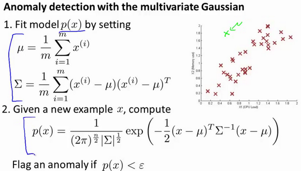
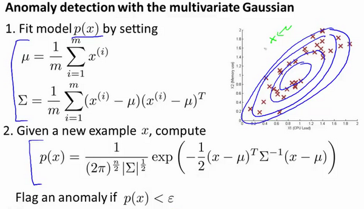
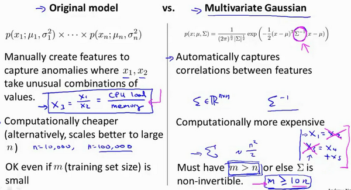

### 15.8 使用多元高斯分布进行异常检测（可选）

参考视频: 15 - 8 - Anomaly Detection using the Multivariate Gaussian Distribution (Optional) (14 min).mkv

在我们谈到的最后一个视频，关于多元高斯分布，看到的一些建立的各种分布模型，当你改变参数，$\mu$ 和 $\Sigma$。在这段视频中，让我们用这些想法，并应用它们制定一个不同的异常检测算法。

要回顾一下多元高斯分布和多元正态分布：

分布有两个参数， $\mu$ 和 $\Sigma$。其中$\mu$这一个$n$维向量和 $\Sigma$ 的协方差矩阵，是一种$n\times n$的矩阵。而这里的公式$x$的概率，如按 $\mu$ 和参数化 $\Sigma$，和你的变量 $\mu$ 和 $\Sigma$，你可以得到一个范围的不同分布一样，你知道的，这些都是三个样本，那些我们在以前的视频看过了。

因此，让我们谈谈参数拟合或参数估计问题：

我有一组样本${{{ x^{(1)},x^{(2)},...,x^{(m)}} }}$是一个$n$维向量，我想我的样本来自一个多元高斯分布。我如何尝试估计我的参数 $\mu$ 和 $\Sigma$ 以及标准公式？

估计他们是你设置 $\mu$ 是你的训练样本的平均值。

$\mu=\frac{1}{m}\sum_{i=1}^{m}x^{(i)}$
并设置$\Sigma$：
$\Sigma=\frac{1}{m}\sum_{i=1}^{m}(x^{(i)}-\mu)(x^{(i)}-\mu)^T$
这其实只是当我们使用**PCA**算法时候，有 $\Sigma$ 时写出来。所以你只需插入上述两个公式，这会给你你估计的参数 $\mu$ 和你估计的参数 $\Sigma$。所以，这里给出的数据集是你如何估计 $\mu$ 和 $\Sigma$。让我们以这种方法而只需将其插入到异常检测算法。那么，我们如何把所有这一切共同开发一个异常检测算法？

首先，我们把我们的训练集，和我们的拟合模型，我们计算$p(x)$，要知道，设定$\mu$和描述的一样$\Sigma$。

如图，该分布在中央最多，越到外面的圈的范围越小。

并在该点是出路这里的概率非常低。

原始模型与多元高斯模型的关系如图：

其中：协方差矩阵$\Sigma$为：

原始模型和多元高斯分布比较如图：

十六、推荐系统(Recommender Systems)
-----------------------------------

