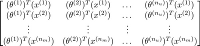

### 16.5 向量化：低秩矩阵分解

参考视频: 16 - 5 - Vectorization\_ Low Rank Matrix Factorization (8 min).mkv

在上几节视频中，我们谈到了协同过滤算法，本节视频中我将会讲到有关该算法的向量化实现，以及说说有关该算法你可以做的其他事情。

举例子：

1. 当给出一件产品时，你能否找到与之相关的其它产品。

2. 一位用户最近看上一件产品，有没有其它相关的产品，你可以推荐给他。

我将要做的是：实现一种选择的方法，写出协同过滤算法的预测情况。

我们有关于五部电影的数据集，我将要做的是，将这些用户的电影评分，进行分组并存到一个矩阵中。

我们有五部电影，以及四位用户，那么 这个矩阵 $Y$ 就是一个5行4列的矩阵，它将这些电影的用户评分数据都存在矩阵里：

| **Movie**            | **Alice (1)** | **Bob (2)** | **Carol (3)** | **Dave (4)** |
| -------------------- | ------------- | ----------- | ------------- | ------------ |
| Love at last         | 5             | 5           | 0             | 0            |
| Romance forever      | 5             | ?           | ?             | 0            |
| Cute puppies of love | ?             | 4           | 0             | ?            |
| Nonstop car chases   | 0             | 0           | 5             | 4            |
| Swords vs. karate    | 0             | 0           | 5             | ?            |

推出评分：

找到相关影片：

现在既然你已经对特征参数向量进行了学习，那么我们就会有一个很方便的方法来度量两部电影之间的相似性。例如说：电影 $i$ 有一个特征向量$x^{(i)}$，你是否能找到一部不同的电影 $j$，保证两部电影的特征向量之间的距离$x^{(i)}$和$x^{(j)}$很小，那就能很有力地表明电影$i$和电影 $j$ 在某种程度上有相似，至少在某种意义上，某些人喜欢电影 $i$，或许更有可能也对电影 $j$ 感兴趣。总结一下，当用户在看某部电影 $i$ 的时候，如果你想找5部与电影非常相似的电影，为了能给用户推荐5部新电影，你需要做的是找出电影 $j$，在这些不同的电影中与我们要找的电影 $i$ 的距离最小，这样你就能给你的用户推荐几部不同的电影了。

通过这个方法，希望你能知道，如何进行一个向量化的计算来对所有的用户和所有的电影进行评分计算。同时希望你也能掌握，通过学习特征参数，来找到相关电影和产品的方法。

