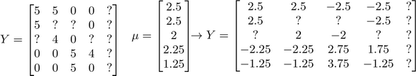

### 16.6 推行工作上的细节：均值归一化

参考视频: 16 - 6 - Implementational Detail\_ Mean Normalization (9 min).mkv

让我们来看下面的用户评分数据：

如果我们新增一个用户 **Eve**，并且 **Eve** 没有为任何电影评分，那么我们以什么为依据为**Eve**推荐电影呢？

我们首先需要对结果 $Y $矩阵进行均值归一化处理，将每一个用户对某一部电影的评分减去所有用户对该电影评分的平均值：

然后我们利用这个新的 $Y$ 矩阵来训练算法。
如果我们要用新训练出的算法来预测评分，则需要将平均值重新加回去，预测$(\theta^{(j)})^T x^{(i)}+\mu_i$，对于**Eve**，我们的新模型会认为她给每部电影的评分都是该电影的平均分。

